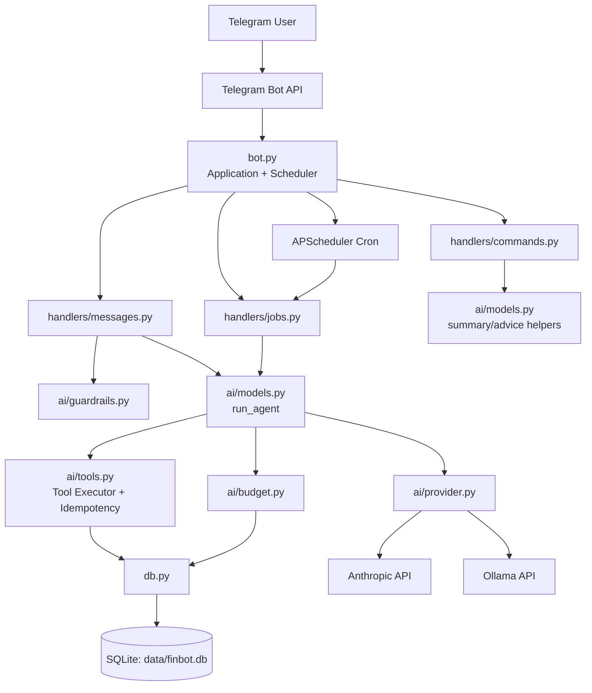

# MoneySage

MoneySage is a Telegram-based autonomous personal finance agent. It can plan actions, call tools, read and write your finance data, ask clarifying questions when needed, and generate AI-driven summaries.

It is designed for a single owner and keeps everything local: Telegram messages are processed through a Python bot, transaction data is stored in SQLite, and AI usage is tracked so it does not exceed a monthly budget.

## Latest changes

- Added a full pytest suite under `tests/` with isolated SQLite fixtures and mocked Telegram/AI integrations
- Added `requirements-dev.txt` and `pytest.ini` for reproducible local test execution
- Added sensitive log redaction in `bot.py` to mask Telegram tokens and common auth/key patterns
- Tightened noisy HTTP logging in `bot.py` (`httpx`/`httpcore` set to `ERROR`)
- Fixed payment-method follow-up flow in `handlers/messages.py` so short replies like `Discover` are processed before guardrail routing

## What it does

- Logs expenses and income from natural language messages
- Adds and removes recurring charges
- Answers financial questions using your own transaction history
- Runs AI-driven daily, weekly, and monthly updates
- Performs tool-calling to query and update finance data
- Asks clarification questions if required fields are missing
- Verifies mutating writes with follow-up read checks
- Prevents duplicate writes with idempotency keys
- Persists lightweight preferences through agent tools
- Warns and stops AI usage when a monthly budget cap is hit

## Tech stack

- Python
- python-telegram-bot
- SQLite
- Anthropic Claude API
- APScheduler
- python-dotenv

## Project structure

- `bot.py` - Telegram bot entrypoint, handlers, scheduler jobs
- `config.py` - runtime configuration and AI provider selection
- `messages.py` - user-facing help and budget-warning text
- `db.py` - SQLite schema and database access helpers
- `ai/provider.py` - provider abstraction (Anthropic or Ollama)
- `ai/models.py` - autonomous agent loop and scheduled agent execution
- `ai/tools.py` - tool registry, tool executor, idempotency wrapper, preference tools
- `handlers/messages.py` - chat handler routed through autonomous agent
- `handlers/commands.py` - slash command handlers
- `handlers/jobs.py` - scheduled daily/weekly/monthly AI updates
- `data/finbot.db` - local database file
- `.env` - local credentials and configuration

## How it works

1. User sends a Telegram message.
2. `bot.py` routes the message to `handlers/messages.py` after owner validation.
3. `models.run_agent(...)` starts a bounded autonomous loop.
4. The model receives available tools and prior tool results, then returns one JSON action:
  - `plan`
  - `tool`
  - `clarify`
  - `final`
5. On `tool`, `ai/tools.py` executes DB-backed tools and returns results.
6. Mutating tools are protected by idempotency keys to prevent duplicate writes.
7. Post-write verification runs follow-up read tools to confirm state.
8. On `final`, the response is sent to Telegram.
9. Scheduled jobs (`handlers/jobs.py`) use `run_scheduled_agent(...)`, so summaries are also tool-driven.

## Architecture



## Environment variables

Create a `.env` file in the project root with values like:

```env
TELEGRAM_BOT_TOKEN=your_telegram_bot_token
OWNER_CHAT_ID=your_numeric_chat_id
AI_PROVIDER=ollama
OLLAMA_BASE_URL=http://localhost:11434
OLLAMA_MODEL=llama3:latest
# ANTHROPIC_API_KEY=your_anthropic_api_key
TIMEZONE=America/New_York
CURRENCY_SYMBOL=$
MONTHLY_BUDGET_USD=5.00
ENFORCE_HARD_CAP=true
```

### Required variables

- `TELEGRAM_BOT_TOKEN` — token from BotFather
- `OWNER_CHAT_ID` — your Telegram user ID; only that chat can interact with the bot

### AI provider variables

- `AI_PROVIDER` - `ollama` or `anthropic`
- `OLLAMA_BASE_URL` - Ollama server URL (used when `AI_PROVIDER=ollama`)
- `OLLAMA_MODEL` - Ollama model name
- `ANTHROPIC_API_KEY` - required only when `AI_PROVIDER=anthropic`

### Optional variables

- `TIMEZONE` — timezone used for scheduler jobs
- `CURRENCY_SYMBOL` — default currency symbol for responses
- `MONTHLY_BUDGET_USD` — monthly Claude API spending cap
- `ENFORCE_HARD_CAP` — if `true`, the bot stops AI calls once budget is reached

## Local setup

```bash
cd /Users/nikhildesai/AI/Agents/MoneySage
python3 -m venv venv
source venv/bin/activate
pip install -r requirements.txt
python bot.py
```

Make sure your `.env` file is populated before starting the bot.

## Running tests

This project includes a pytest suite with isolated SQLite fixtures and mocked Telegram/AI calls.

```bash
cd /Users/nikhildesai/AI/Agents/MoneySage
source .venv/bin/activate
pip install -r requirements-dev.txt
pytest
```

Current coverage focus:
- DB persistence and monthly aggregates
- Tool validation and idempotency
- Agent loop actions (plan/tool/final/clarify)
- Telegram command/message handler behavior
- Scheduled job delivery paths

## Usage examples

Natural-language messages:

- "Paid 45 for groceries with Discover"
- "Got salary 3000"
- "Netflix 15/month starting today"
- "Cancel my Netflix"
- "How much did I spend on food this month?"
- "Can I afford a 200 jacket right now?"
- "Use my default card for groceries unless I say cash"

Commands:

- `/start`
- `/help`
- `/balance`
- `/recurring`
- `/summary_week`
- `/summary_month`
- `/usage`

## SQLite schema

The app uses SQLite tables for:

- `transactions` — expenses and income entries
- `recurring_charges` — subscriptions or repeating payments
- `reminders_sent` — deduplication for recurring reminders
- `api_usage` — token usage and cost tracking for budget enforcement
- `tool_idempotency` — dedupe storage for mutating tool calls and preference values

## Agent capabilities

- Tool-driven finance reads and writes
- Structured clarification when data is missing
- Post-write verification reads
- Persistent preference memory via tools
- Bounded autonomous loop for safer execution

## Budget protection

Every Claude API call is logged and priced using real token counts. The app tracks cost per month and can stop AI access when the configured cap is reached.

This prevents surprise bills while still allowing useful budgeting features.

## Deployment

This project includes Docker and Fly.io configuration. It is set up to run as a long-polling Telegram bot without needing a public webhook endpoint.

### Fly.io example

```bash
fly auth login
fly launch --no-deploy
fly secrets set TELEGRAM_BOT_TOKEN=... OWNER_CHAT_ID=... ANTHROPIC_API_KEY=...
fly deploy
```

## Security notes

- Access is restricted to a single Telegram chat via `OWNER_CHAT_ID`
- Bot privacy is best kept enabled so strangers cannot interact with it
- `.env` should never be committed to source control
- Data is stored locally in SQLite and should be backed up periodically

## Limitations

- Designed for a single owner / single user workflow
- Currency is global and not fully multi-currency aware
- Recurring charges use a day-of-month model
- Categories are model-inferred and can vary over time
- Autonomous loop is bounded by max steps per request

## Future ideas

- Budgeting by category
- CSV import from bank exports
- Better recurring charge customization
- Charts and richer reporting
- Multi-user support

## License

This project is intended for personal use and local deployment. If you plan to publish or distribute it, add an explicit license file before doing so.
